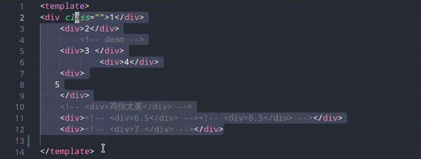

<p align='left' style='font-size:30px' > 易用的注释代码 </p>
<p align=''> 这个是基于默认功能注释，功能优化插件 </p>
<!-- <p align=''> 中文 | <a href='./README.en-US.md'>English</a> </p> -->


## 使用方式

>CTRL+/



## 🎉当前支持的文件

- vue(支持标签嵌套，css嵌套待支持)

- wxml

- xml

- css

- postcss

- jsx / tsx


- html(支持标签嵌套，css嵌套待支持)


```html
<template>
    注释之前
     <div>
        <!-- <div></div>  -->
        <div></div>
        <!-- <div></div>  -->
     </div> 
     注释之后
     <!-- <div> -->
        <!-- <!~~ <div></div>  ~~> -->
        <!-- <div></div> -->
        <!-- <!~~ <div></div>  ~~> -->
      <!-- </div> -->

  多层级注释 comments
    <!-- <div></div> --> <!-- <div><!~~ <div></div> ~~></div> --> <!-- <div></div> -->

  解除多层注释 unComments-1
       <!-- <div></div> --> <!-- <div><!~~ <div></div> ~~></div> --> <!-- <div></div> -->
  解除多层注释 unComments-2
       <div></div> <div><!-- <div></div> --></div> <div></div>
  解除多层注释 unComments-3
       <div></div> <div><div></div></div> <div></div>
</template>
```

react

```jsx

注释前
{/* <div></div> */}
<div></div>
{/* <div></div> */}


注释后
{/* <!~~ <div></div> ~~> */}
{/* <div></div> */}
{/* <!~~ <div></div> ~~> */}

```


[更多功能](./example/html-line-by-line.md)

## 关于 

[marketplace](https://marketplace.visualstudio.com/items?itemName=breakon.easy-comments-code)

## 许可证MIT

[MIT](https://opensource.org/licenses/MIT)


